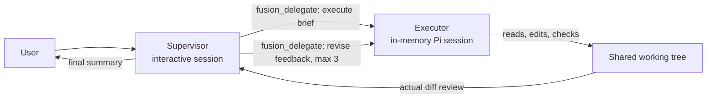

# Pi Fusion Extension

A price-tiered supervisor/executor orchestration extension for the Pi coding agent, inspired by the Fusion architecture. The interactive Pi session becomes a supervisor that plans, briefs, and reviews, while implementation and verification are delegated to a separate executor agent running on a cheaper model in its own isolated session. Model selection is additionally restricted to a curated cohort of recent coding models, since Pi does not expose release dates.

This is an independent community Pi extension. It is not an official Cognition or Devin product and is not affiliated with either.

## How it works



The supervisor and executor are two separate model sessions. They do not share conversation context: everything the executor needs travels through the `fusion_delegate` tool as a self-contained brief, and everything it returns travels back as a report. What they share is the working directory — the executor runs its own Pi SDK session in the same `cwd`, so its file edits are immediately visible to the supervisor, which inspects the real working tree and diff rather than trusting the summary.

No temporary Markdown files, `/tmp` files, or other on-disk communication channels are created. Coordination happens entirely through the tool call boundary.

While the executor works, the Fusion widget and the `fusion_delegate` tool display show a bounded chronological work transcript: brief progress notes, tool calls with their targets, completion/failure entries, and truncated text results. Hidden thinking streams are never displayed — a `reasoning` status entry is all that surfaces. The transcript lives in the tool's display details and is not prepended to the model-facing result content, so it does not inflate the supervisor's context. Token and cost usage is tracked separately for the supervisor and the executor; the executor total covers the whole run, including revisions.

The executor ends its final message with a fenced JSON report (`status`, `summary`, `files_changed`, `checks`, `blockers`). Fusion parses it leniently — the last ```json block wins, malformed entries are dropped, and missing or invalid output degrades to an `unknown` status with the raw prose kept. The model-facing tool result is a compact rendering of that report plus a `git diff --stat` computed by the extension: `git status --porcelain` snapshots taken before and after the delegation are compared, `git diff --stat` runs over the modified and still-dirty touched paths, and untracked or staged-new files are listed as `new:` lines. The raw prose lives in the tool details, and the rendered row shows a color-coded report above the last lines of the transcript.

While planning or reviewing, the supervisor can also call `fusion_scout` with 1–5 read-only questions (at most 4 calls per run, and at most 20 tool calls per invocation — a capped scout returns whatever partial answer it produced). The scout runs on the executor model with its own configurable thinking level (default `low`, or the lowest supported level) in a disposable session restricted to `read`, `grep`, `find`, and `ls`, and answers with `path:line` citations, truncated to ~3000 characters. Scout usage is tracked separately and shown in the widget and `/fusion-status`.

The `fusion_delegate` and `fusion_scout` tools are only exposed to the model while a Fusion run or Fusion mode is active; the extension syncs the active tool list on run start, run completion, mode toggles, `/fusion-clean`, and session lifecycle events.

## Model tiers

Selection is driven by each model's `cost.output` metadata: USD per million output tokens, as reported by Pi's model catalog.

- Supervisor models must have a known output price at least $10/M.
- Executor models must have an output price at or below $10/M.
- A model priced at exactly $10/M appears in both selectors.
- Models with missing, invalid, or unknown pricing qualify for the executor tier only.
- On top of pricing, both tiers are restricted to a curated cohort of recent (2025–2026) coding model families. Pi exposes no release-date metadata, so the cohort is a maintained allowlist of patterns; older or undated models are hidden from selection entirely.

The price threshold lives in `FUSION_OUTPUT_PRICE_THRESHOLD` in `src/pricing.ts`; the cohort patterns live in `RECENT_MODEL_PATTERNS` in `src/recent-models.ts`.

## Installation

### Project-local development

Clone or copy this repository and launch `pi` from the repository root. Pi auto-discovers `.pi/extensions/fusion.ts` after the project is trusted, and that file loads `src/index.ts`.

### Local Pi package

From the package root:

```bash
pi install ./
```

The `pi.extensions` field in `package.json` points Pi at `./src/index.ts`.

### One-off

```bash
pi --extension ./src/index.ts
```

## Commands

| Command | Behavior |
|---------|----------|
| `/fusion-config` | Search and select the price-tiered supervisor and executor models. Each selector prompts for search text first (blank shows everything in the cohort), then lists matching recent models with their output pricing. After each model is chosen, a second picker offers the thinking levels that model supports, highest first, with the top entry marked `(default)`; models that cannot reason skip the picker and use `off`. The executor model gets a third picker for the scout thinking level (default `low`, falling back to the lowest supported non-`off` level). In the TUI pickers show at most 10 rows and scroll with Up/Down; other frontends use the standard select dialog. The pair and its thinking levels are remembered and reused by `/fusion` and `/fusion-mode`. |
| `/fusion [task]` | Run one task through the protocol. Prompts for the task in an editor when omitted, sets the supervisor model and thinking level with `pi.setModel`/`pi.setThinkingLevel`, starts a fresh run, warms up the executor session in the background, and sends the supervisor prompt. Reuses the configured pair when present. |
| `/fusion-mode` | Toggle persistent mode. When enabled, ordinary interactive text prompts are transformed into the supervisor protocol automatically and the supervisor thinking level is reapplied to each intercepted prompt. When disabled, the active executor is disposed and the widget cleared. |
| `/fusion-status` | Show mode, cohort, supervisor/executor labels with output pricing and thinking levels, scout thinking level, current phase, revision count, per-run supervisor, executor, and scout usage totals, current executor activity, and the last delegation timings (session-ready wait, first executor event, total). |
| `/fusion-clean` | Wait for the agent to go idle, dispose the executor session, and clear run data (task, revisions, phase). Model configuration and mode are preserved. Creates no temporary files. |

Quick start:

```
/fusion-config          # search, then pick supervisor (>= $10/M) and executor (<= $10/M)
/fusion refactor the retry logic in src/api.ts
/fusion-status          # inspect phase and revision count
/fusion-mode            # make every prompt go through Fusion
/fusion-mode            # toggle it back off
/fusion-clean           # drop executor context and run state
```

## Workflow

1. Configure once with `/fusion-config`, or let `/fusion` / `/fusion-mode` prompt for a pair on first use.
2. The supervisor investigates through `fusion_scout` for broad searches and file discovery, reads the few design-deciding files itself, and writes a self-contained brief: objective, files, constraints, edge cases, exact verification checks — plus the relevant scout findings so the executor does not search again.
3. `fusion_delegate` with `action: "execute"` drives a persistent in-memory Pi SDK `AgentSession` for the executor: its own system prompt, project skills and context files, the configured executor thinking level, and the standard read/edit/bash tool set. Extensions and prompt templates are disabled on the executor so it cannot re-enter Fusion. Session creation is warmed up in the background when a run starts — the `DefaultResourceLoader` is loaded once per working directory and reused — so the executor is usually ready before the supervisor finishes planning, and an unused warm session is carried into the next task instead of being rebuilt.
4. The executor works the brief directly in the shared working tree and finishes with a structured JSON report. The tool result is its compact rendering plus a real diff stat (from before/after `git status` snapshots and the executor's touched paths), per-invocation token and cost usage, the cumulative executor total for the run, and a one-line timing breakdown (`ready`, `first event`, `total` milliseconds). Widget and transcript updates are throttled to one render per ~150 ms while the executor streams.
5. The supervisor reviews the actual working tree and diff — never the summary alone. When the report is `done`, every check passed, there are no blockers, and the diff stat is small, the review is limited to the changed hunks; otherwise (any FAIL, blockers, a partial/blocked/unknown status, or a large or unexpected diff) the supervisor does a full review and re-runs the checks itself.
6. Defects are batched into one consolidated revision brief per `fusion_delegate` `action: "revise"` call, up to 3 revisions per task.
7. The supervisor takes over only if the executor is blocked, then delivers a final user-facing summary with the checks that passed.

## Session and data handling

- The executor uses `SessionManager.inMemory(cwd)`: nothing is persisted to the session store.
- The executor session is disposed when a new task starts, when Fusion mode is disabled, on `session_shutdown`, and via `/fusion-clean`.
- The selected supervisor/executor pair and mode flag live only in extension memory; they reset when Pi exits or the extension reloads.
- Because both agents share the filesystem, executor edits are visible to the supervisor immediately.
- Usage is tracked per run and per role: supervisor tokens are aggregated from the main session's assistant turns, executor tokens from each `fusion_delegate` invocation (initial execution plus revisions). Totals reset on a new task, mode disable, session shutdown, and `/fusion-clean`.
- The extension writes no prompts, briefs, or secrets to temporary files.

## Safety and limitations

- Extensions run with the full permissions of the Pi process. Only install this package from sources you trust, and only enable project-local extensions in trusted repositories.
- The executor can read, edit, and run tools in the working directory under the same project instructions and Pi permissions as a normal session.
- Fusion mode is text-only: image attachments in intercepted prompts are rejected with a warning.
- Tiering depends on provider/model catalog pricing metadata. Models without trustworthy pricing are executor-only by design.
- The recent-model cohort is a hand-maintained pattern list: a selection heuristic, not authoritative release dates, and it needs occasional updates as new model families ship.
- Only one Fusion run is active at a time, and a run allows one initial execution plus at most 3 revisions.
- State is not durable across process restarts or extension reloads.

## Development

| Path | Purpose |
|------|---------|
| `src/git-changes.ts` | `git status --porcelain` parsing and before/after change detection for the diff stat. |
| `src/index.ts` | Extension entry point: tool, commands, input interception, widget, executor lifecycle. |
| `src/limits.ts` | Central run limits and tuning constants (revisions, scout caps, throttle, timeouts). |
| `src/prompts.ts` | Supervisor/executor/scout prompt construction. |
| `src/pricing.ts` | Output-price tier logic and priced model labels. |
| `src/progress.ts` | Bounded chronological executor transcript and tool-result summaries. |
| `src/recent-models.ts` | Curated recent-model cohort matching and search. |
| `src/report.ts` | Lenient parsing and compact rendering of the executor's JSON report. |
| `src/scrollable-select.ts` | TUI picker capped at 10 visible rows; falls back to the standard select dialog outside TUI. |
| `src/thinking.ts` | Thinking-level ordering (highest first), supervisor/executor and scout defaults, and agent-level conversion. |
| `src/throttle.ts` | Trailing-edge `createThrottle` used to coalesce executor render updates. |
| `src/usage.ts` | Incremental `Usage` aggregation for executor invocations. |
| `.pi/extensions/fusion.ts` | Project-local shim re-exporting `src/index.ts` for auto-discovery. |
| `test/*.test.ts` | `bun:test` unit tests for prompts, pricing, cohort matching/search, git change detection, progress transcript, report parsing, thinking levels, throttle, and usage aggregation. |

```bash
bun test
bun run typecheck
```

The `@earendil-works/pi-agent-core`, `@earendil-works/pi-ai`, `@earendil-works/pi-coding-agent`, `@earendil-works/pi-tui`, and `typebox` host packages are peer dependencies supplied by Pi at runtime; they do not need to be installed into this repository for normal use.

## License

MIT
