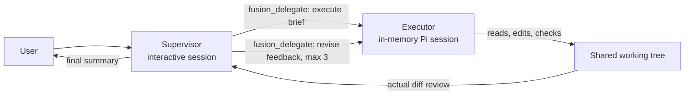

# Pi Fusion Extension

A price-tiered supervisor/executor orchestration extension for the Pi coding agent, inspired by the Fusion architecture. The interactive Pi session becomes a supervisor that plans, briefs, and reviews, while implementation and verification are delegated to a separate executor agent running on a cheaper model in its own isolated session. Model selection is additionally restricted to a curated cohort of recent coding models, since Pi does not expose release dates.

This is an independent community Pi extension. It is not an official Cognition or Devin product and is not affiliated with either.

## How it works



The supervisor and executor are two separate model sessions. They do not share conversation context: everything the executor needs travels through the `fusion_delegate` tool as a self-contained brief, and everything it returns travels back as a report. What they share is the working directory — the executor runs its own Pi SDK session in the same `cwd`, so its file edits are immediately visible to the supervisor, which inspects the real working tree and diff rather than trusting the summary.

No temporary Markdown files, `/tmp` files, or other on-disk communication channels are created. Coordination happens entirely through the tool call boundary.

## Model tiers

Selection is driven by each model's `cost.output` metadata: USD per million output tokens, as reported by Pi's model catalog.

- Supervisor models must have a known output price at least $10/M.
- Executor models must have an output price at or below $10/M.
- A model priced at exactly $10/M appears in both selectors.
- Models with missing, invalid, or unknown pricing qualify for the executor tier only.
- On top of pricing, both tiers are restricted to a curated cohort of recent (2025–2026) coding model families. Pi exposes no release-date metadata, so the cohort is a maintained allowlist of patterns; older or undated models are hidden from selection entirely.

The price threshold lives in `FUSION_OUTPUT_PRICE_THRESHOLD` in `src/pricing.ts`; the cohort patterns live in `RECENT_MODEL_PATTERNS` in `src/recent-models.ts`.

## Installation

### Project-local development

Clone or copy this repository and launch `pi` from the repository root. Pi auto-discovers `.pi/extensions/fusion.ts` after the project is trusted, and that file loads `src/index.ts`.

### Local Pi package

From the package root:

```bash
pi install ./
```

The `pi.extensions` field in `package.json` points Pi at `./src/index.ts`.

### One-off

```bash
pi --extension ./src/index.ts
```

## Commands

| Command | Behavior |
|---------|----------|
| `/fusion-config` | Search and select the price-tiered supervisor and executor models. Each selector prompts for search text first (blank shows everything in the cohort), then lists matching recent models with their output pricing. In the TUI the result picker shows at most 10 models and scrolls with Up/Down; other frontends use the standard select dialog. The pair is remembered and reused by `/fusion` and `/fusion-mode`. |
| `/fusion [task]` | Run one task through the protocol. Prompts for the task in an editor when omitted, sets the supervisor model with `pi.setModel`, starts a fresh run, and sends the supervisor prompt. Reuses the configured pair when present. |
| `/fusion-mode` | Toggle persistent mode. When enabled, ordinary interactive text prompts are transformed into the supervisor protocol automatically. When disabled, the active executor is disposed and the widget cleared. |
| `/fusion-status` | Show mode, supervisor/executor labels with output pricing, current phase, and revision count. |
| `/fusion-clean` | Wait for the agent to go idle, dispose the executor session, and clear run data (task, revisions, phase). Model configuration and mode are preserved. Creates no temporary files. |

Quick start:

```
/fusion-config          # search, then pick supervisor (>= $10/M) and executor (<= $10/M)
/fusion refactor the retry logic in src/api.ts
/fusion-status          # inspect phase and revision count
/fusion-mode            # make every prompt go through Fusion
/fusion-mode            # toggle it back off
/fusion-clean           # drop executor context and run state
```

## Workflow

1. Configure once with `/fusion-config`, or let `/fusion` / `/fusion-mode` prompt for a pair on first use.
2. The supervisor investigates the repository itself, resolves ambiguity, and writes a self-contained brief: objective, files, constraints, edge cases, exact verification checks.
3. `fusion_delegate` with `action: "execute"` lazily creates a persistent in-memory Pi SDK `AgentSession` for the executor: its own system prompt, project skills and context files, and the standard read/edit/bash tool set. Extensions and prompt templates are disabled on the executor so it cannot re-enter Fusion.
4. The executor works the brief directly in the shared working tree and reports changed files, checks run, and blockers. Per-invocation token and cost usage is returned in the tool result.
5. The supervisor reviews the actual working tree and diff — not the executor's summary — and may re-run checks itself.
6. Defects are batched into one consolidated revision brief per `fusion_delegate` `action: "revise"` call, up to 3 revisions per task.
7. The supervisor takes over only if the executor is blocked, then delivers a final user-facing summary with the checks that passed.

## Session and data handling

- The executor uses `SessionManager.inMemory(cwd)`: nothing is persisted to the session store.
- The executor session is disposed when a new task starts, when Fusion mode is disabled, on `session_shutdown`, and via `/fusion-clean`.
- The selected supervisor/executor pair and mode flag live only in extension memory; they reset when Pi exits or the extension reloads.
- Because both agents share the filesystem, executor edits are visible to the supervisor immediately.
- The extension writes no prompts, briefs, or secrets to temporary files.

## Safety and limitations

- Extensions run with the full permissions of the Pi process. Only install this package from sources you trust, and only enable project-local extensions in trusted repositories.
- The executor can read, edit, and run tools in the working directory under the same project instructions and Pi permissions as a normal session.
- Fusion mode is text-only: image attachments in intercepted prompts are rejected with a warning.
- Tiering depends on provider/model catalog pricing metadata. Models without trustworthy pricing are executor-only by design.
- The recent-model cohort is a hand-maintained pattern list: a selection heuristic, not authoritative release dates, and it needs occasional updates as new model families ship.
- Only one Fusion run is active at a time, and a run allows one initial execution plus at most 3 revisions.
- State is not durable across process restarts or extension reloads.

## Development

| Path | Purpose |
|------|---------|
| `src/index.ts` | Extension entry point: tool, commands, input interception, widget, executor lifecycle. |
| `src/prompts.ts` | Supervisor/executor prompt construction and `MAX_REVISIONS`. |
| `src/pricing.ts` | Output-price tier logic and priced model labels. |
| `src/recent-models.ts` | Curated recent-model cohort matching and search. |
| `src/scrollable-select.ts` | TUI picker capped at 10 visible rows; falls back to the standard select dialog outside TUI. |
| `src/usage.ts` | Incremental `Usage` aggregation for executor invocations. |
| `.pi/extensions/fusion.ts` | Project-local shim re-exporting `src/index.ts` for auto-discovery. |
| `test/*.test.ts` | `bun:test` unit tests for prompts, pricing, cohort matching/search, and usage aggregation. |

```bash
bun test
bun run typecheck
```

The `@earendil-works/pi-agent-core`, `@earendil-works/pi-ai`, `@earendil-works/pi-coding-agent`, `@earendil-works/pi-tui`, and `typebox` host packages are peer dependencies supplied by Pi at runtime; they do not need to be installed into this repository for normal use.

## License

MIT
